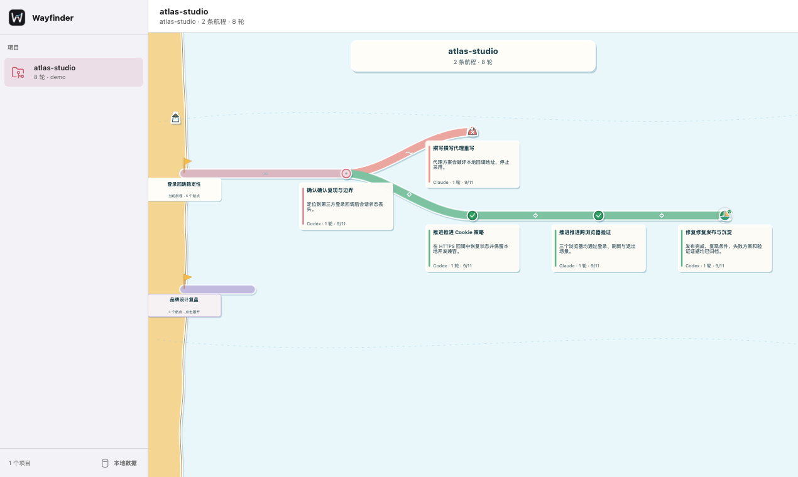

# Wayfinder

**See how your work with AI actually evolved.**

Wayfinder is a local-first desktop app that turns work with AI into a visual
history of how a project reached its result. Goals, alternative attempts,
failures, decisions, validation, and artifacts stay connected instead of
disappearing into separate chats.

Wayfinder is designed for AI collaboration across coding, research, writing,
design, and other project work. The current early-access collectors support
Codex and Claude Code.

[Download Wayfinder](https://github.com/WBXWHT/wayfinder/releases) ·
[Website](https://wayfinder-ai.pages.dev) ·
[Install guide](docs/INSTALL.md) ·
[Privacy](PRIVACY.md) ·
[Report an issue](https://github.com/WBXWHT/wayfinder/issues)



## Why Wayfinder

AI tools are good at producing the next answer. They are less useful at showing
why one approach worked, why another failed, or which evidence changed the
direction of a project.

Wayfinder keeps that path reviewable:

- **One project map** across AI tools.
- **Separate voyages** for unrelated goals in the same workspace.
- **Visible branches and failures** instead of a cleaned-up success story.
- **Real file-change replay** when the source session contains an edit.
- **Source-linked details** for conversations, tool activity, files, and
  validation.

## How It Works

1. Install and open the desktop app.
2. Keep working normally with your AI tools.
3. Return to Wayfinder to review how the project evolved.

Related sessions are grouped locally. Every recorded turn retains its original
source, and Wayfinder does not invent missing history or historical diffs.

## Downloads

Wayfinder early access is available for:

| Platform | Build |
| --- | --- |
| macOS | Apple Silicon and Intel |
| Windows | x64 |

Download the latest installers and checksums from
[GitHub Releases](https://github.com/WBXWHT/wayfinder/releases). The current
early-access builds are not store-signed; read the
[install guide](docs/INSTALL.md) before first launch.

## Local By Default

Wayfinder stores normalized history, collection cursors, and snapshots under
`~/.wayfinder`. There is no Wayfinder account, analytics service, advertising,
cloud sync, or cloud analysis in the current build.

Read [PRIVACY.md](PRIVACY.md) before using confidential projects.

## Current Scope

- Standalone desktop application for macOS and Windows.
- AI collaboration model spanning conversations, research, writing, design,
  coding, and other project work.
- Current early-access collection from Codex and Claude Code.
- Project-level voyage grouping, branches, source details, and file-change
  replay.
- Early access: data formats and grouping behavior may continue to evolve.

Historical plugins, MCP bundles, IDE extensions, package-manager taps, and
standalone CLI artifacts are not current product surfaces.

## Development

```bash
npm ci
npm run check
npm run companion:prepare
npm run companion:build
```

The test suite covers collection, voyage grouping, the desktop renderer,
trackpad pan and zoom, detail inspection, and narrow-screen behavior.
